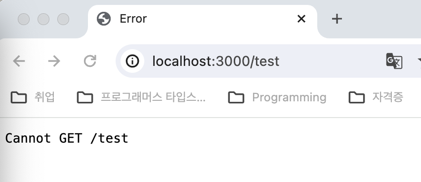
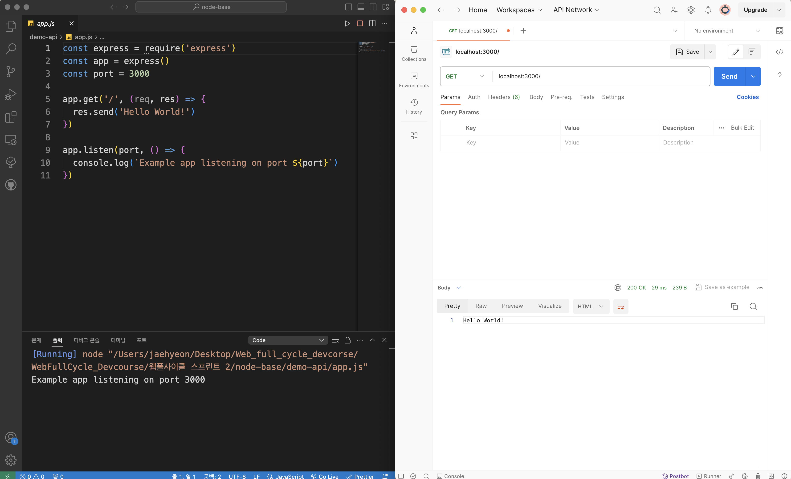
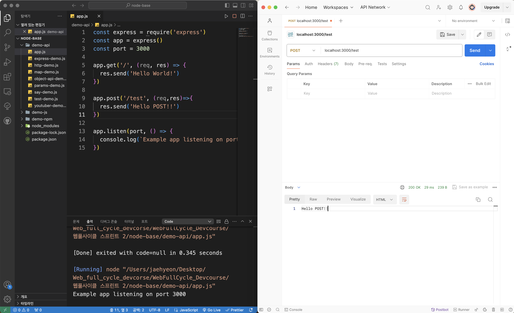
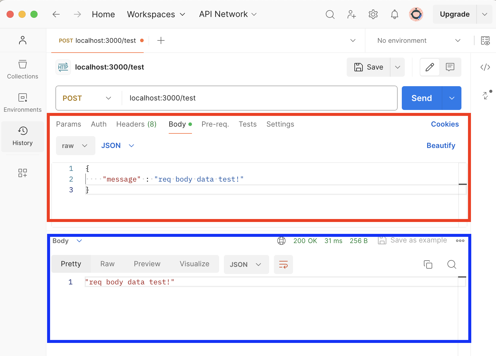

# <Node.js 및 Express.js를 사용한 서버 개발 실습 (1)>

# Part 5. Express와 천천히 친해지기

## Chapter 1. 웹브라우저로 테스트가 안됩니다. postman의 등장

### 1. HTTP method : POST

- 지금까지는 웹브라우저에게 GET method를 통해 정보를 담은 URL을 보내고 웹페이지에 출력시켜보았다.
- 이제는 다른 method인 POST를 사용해 볼 것이다.
- POST는 새로운 정보를 “등록”할 때 사용하는데, 주로 회원가입 부분에서 사용된다.
    - 하지만 인터넷은 공개적으로 연결된 환경이기에 우리의 아이디, 비밀번호와 같은 개인정보가 지켜지지 않는다. 그래서 이러한 정보를 지키기 위해 HTTP 프로토콜의 BODY부분에 숨겨서 URL로 보내야 한다.
        
        즉, HTTP 프로토콜의 BODY부분에 숨겨진 정보가 존재하는 URL을 보내야만 POST method를 정상적으로 사용할 수 있다. (그리고 보통 숨긴 정보를 암호화까지 하는게 일반적이다)
        
- 그렇다면 숨겨진 정보를 BODY에 담아서 지금까지 했던 것 처럼 웹브라우저에게 URL을 보내면 되겠구나?
    - No! BODY에 숨겨진 정보가 담긴 URL을 바로 웹브라우저로 보내면 웹브라우저는 BODY의 숨겨진 정보를 열어볼 수 없다. 웹브라우저는 단순한 문자 정보를 조회하기만하는 GET method만 지원이 되고있기 때문이다.
    - Post method 코드
        
        ```jsx
        const express = require('express')
        const app = express()
        const port = 3000
        
        app.get('/', (req, res) => {
          res.send('Hello World!')
        })
        
        app.post('/test', (req,res)=>{
          res.send('Hello POST!!')
        })
        
        app.listen(port, () => {
          console.log(`Example app listening on port ${port}`)
        })
        ```
        
    - POST 결과
            
        
            
    - 그렇다면 POST method와 같이 BODY에 숨겨진 정보가 담긴 URL을 웹사이트에서 정상적으로 사용할 수 있는 방법은 무엇이 있을까? 실습도 해야되는데 말이다.
    - **바로 이때 사용되는 테스트 도구가 "Postman" 이다!**

### 2. Postman GET method test, POST method 간단테스트

- GET method in Postman
    
    
    
    - Postman에서 워크스페이스를 추가하고 좌측상단의 ‘ + ’ 버튼을 누르면 HTTP method들을 선택할 수 있고 URL을 입력할 수 있는 창이 뜬다.
    - 기존에 했던것 처럼 method를 GET으로 정하고 주소 [localhost:3000/](http://localhost:3000/) 을 입력하면 현재 구동중인 app.js 코드대로 Hello World가 Postman하단에 출력됨을 알 수 있다.
- Post method in Postman (간단 테스트)
    
    
    
    - 지금까지 GET method를 사용했던 것처럼 POST method도 함수를 만들고 사용해보았다.
    - 웹브라우저에서는 POST method를 사용하는 URL을 보내도 반응이 없었지만, Postman에서는 정상적으로 작동함을 확인할 수 있다!

### 3. POST req, res 구현 & 테스트

- POST method 구현 코드
    
    ```jsx
    // app.js (서버 구동 코드)
    
    const express = require('express')
    const app = express()
    const port = 3000
    
    app.get('/', (req, res) => {
      res.send('Hello World!')
    })
    
    app.use(express.json()) //express 모듈 연결!
    app.post('/test', (req,res)=>{
    
      console.log(req.body) // body에 숨겨져서 들어온 데이터를 확인해보자!
      res.json(req.body.message) // body에 숨겨진 데이터의 key값으로 value값을 화면에 출력해볼까?
      
    })
    
    app.listen(port, () => {
      console.log(`Example app listening on port ${port}`)
    })
    ```
    
- Postman 화면
    
    
    
    - Postman 화면 설명
        1. 빨간 상자부분은 우리가 지금까지 다뤘던 **요청부분(req)** 이다.
            - 우리는 현재 Body에 데이터를 숨겨서 보내려하는 것이기에 req의 Body를 체크한다.
            - 설정값으로는 코드를 어떻게 보여줄지는 “ raw “ , 형식은 “JSON ”으로 설정한다.
            - Body에 숨겨서 보낼 데이터의 형식을 JSON으로 설정했기에 데이터를 입력해줄 때도 JSON형식으로 입력해주어야 한다.
        2. 파란 상자부분은 우리가 지금까지 다뤘던 **응답부분(res)** 이다.
            - 우리가 지금까지 웹페이지 화면에 출력되는 내용이 이곳에도 똑같이 출력된다.
            - 여기서도 설정값을 통해 여러 버전으로 출력되는 화면을 볼 수 있다.
    - 이제 app.js를 실행시켜 서버를 구동하고 Postman에서 데이터를 숨긴 Body값을 요청하기위해 Send 버튼을 눌러보도록 하자.
        - app.js 코드에서 이제야 req에 JSON 형식의 값이 들어오게 된다.
        - 그래서 `res.json(req.body.message)` 코드를 통해 BODY에 숨겨져있던 데이터를 확인할 수 있고, 데이터가 JSON 형식이니까 key값을 가지고 value값을 확인해볼 수 도 있다.

### 4. 유튜버 등록 (POST method 실습)

- 기존에 작성했었던 youtuber-demo.js 코드에 기능을 추가하여 고도화 해보도록 하자.
    - 기존 youtuber-demo.js 코드
        
        ```jsx
        // express 모듈 설정
        const express = require('express')
        const app = express()
        
        app.listen(3000)
        
        // 데이터 설정
        const youtuber1={
            channelTitle : "십오야",
            sub : "593만명",
            videoNum : "993개"
        }
        
        const youtuber2={
            channelTitle : "침착맨",
            sub : "227만명",
            videoNum : "6.6천개"
        }
        
        const youtuber3={
            channelTitle : "테오",
            sub : "54.8만명",
            videoNum : "726개"
        }
        
        // Map 객체 활용
        let db = new Map()
        
        db.set(1, youtuber1)
        db.set(2, youtuber2)
        db.set(3, youtuber3)
        
        // REST API 설계
        app.get("/youtuber/:id", function(req,res){
            let {id} = req.params
            id = parseInt(id)
        
            let youtuber_inf = db.get(id);
        
            if(youtuber_inf == undefined){
                res.json({
                    message : "유튜버 정보를 찾을 수 없어요"
                })
            }else{
                res.json(youtuber_inf)
            }
        })
        ```
        
    - 유튜버 등록 기능 추가 후 youtuber-demo.js 코드 (아직 미완. 강의가 24.03.21까지 이어짐)
        
        ```jsx
        // express 모듈 설정
        const express = require('express')
        const app = express()
        
        app.listen(3000)
        
        // 데이터 설정
        const youtuber1={
            channelTitle : "십오야",
            sub : "593만명",
            videoNum : "993개"
        }
        
        const youtuber2={
            channelTitle : "침착맨",
            sub : "227만명",
            videoNum : "6.6천개"
        }
        
        const youtuber3={
            channelTitle : "테오",
            sub : "54.8만명",
            videoNum : "726개"
        }
        
        // Map 객체 활용
        let db = new Map()
        
        let id = 1; // 전역변수 선언
        // 유튜버 매번 등록마다 Map객체 데이터 추가해야함.
        // 매번 key값 자동 증가 기능을 위해 사용되는 변수
        
        db.set(id++,youtuber1)
        db.set(id++,youtuber2)
        db.set(id++,youtuber3)
        
        app.use(express.json()) // '미들웨어' : json 설정
        
        // 유튜버 등록기능 추가 (POST method 활용)
        app.post('/youtubers',(req,res)=>{
            db.set(id++, req.body) //BODY에 숨겨진 내용이기에 req.body 참조
            const {channelTitle} = db.get(id-1)
        
            res.json({
                "message" : `${channelTitle}님, 유튜버 생활을 응원합니다!`
            })
        })
        
        // 등록되어있는 유튜버 전체 조회 기능 개발 중
        app.get('/youtubers', (req,res)=>{
            res.json(db)
        })
        
        // REST API 설계
        app.get('/youtubers/:id',(req,res)=>{
            let {id} = req.params
            id = parseInt(id)
            let youtuber_inf = db.get(id);
        
            if(youtuber_inf == undefined){
                res.json({
                    message : `유튜버 정보를 찾을 수 없어요`
                })
            }else{
                res.json(youtuber_inf)
            }
        })
        
        // 처음에 내가 한번 만들어본 코드 ====================================
        // usableId = 1; //전역변수 선언
        //
        // // 유튜버를 등록할때마다 전역변수를 증가시켜주는 함수 선언
        // function idCheck(id){
        //     if(db.get(id)==undefined){
        //         return id;
        //     }else{
        //         return usableId += 1;
        //     }
        // }
        
        // db.set(idCheck(usableId), youtuber1)
        // db.set(idCheck(usableId), youtuber2)
        // db.set(idCheck(usableId), youtuber3)
        
        // app.use(express.json()) // '미들웨어' : json 설정
        // app.post("/youtuber", (req,res)=>{
            
        //     db.set(idCheck(usableId), req.body)
        //     const {channelTitle} = db.get(usableId)
        
        //     res.json({
        //         "message" : `${channelTitle}님, 유튜버 생활을 응원합니다!`
        //     })
        //     console.log(usableId)
        // })
        
        // // REST API 설계
        // app.get("/youtuber/:id", function(req,res){
        //     let {id} = req.params
        //     id = parseInt(id)
        
        //     let youtuber_inf = db.get(id);
        
        //     if(youtuber_inf == undefined){
        //         res.json({
        //             message : `유튜버 정보를 찾을 수 없어요`
        //         })
        //     }else{
        //         res.json(youtuber_inf)
        //     }
        // })
        ```
        

### 5. 변수의 스코프에 대하여! (수업듣다가 깨달은 점)

- youtuber-demo.js 코드의 고도화 과정중에 전역변수를 선언하여 새로운 유튜버 등록 시 마다 id값이 증가되도록 해주는 기능을 구현하는 부분이 있다.
    
    이때, let이든 const든 var든 함수레벨 내부나 블록레벨 내부가 아닌 곳에서 선언을 하면 전역변수로 취급된다. 이를 강사님께서도 활용한 것이다.
    
    순간, 자바스크립트에서 전역변수 선언에 대해 정확히 알고있지 못해 혼동이 되었다. 잘 기억하자
    
- 이전에 배웠던 함수레벨과 블록레벨( { } ) 스코프에 대한 건, 변수를 어디서 선언했는지에 따라 스코프가 정해진다는 것을 강조한 것이다.
    - **함수레벨 내부에서 선언된 var, let, const 변수는 함수레벨 밖에서 참조가 안되는 것**
    - **블록레벨 내부에서 선언된 let, const 변수는 블록레벨 밖에서 참조가 안되는 것**
    - **함수레벨도 아닌 블록레벨도 아닌 위치에서 선언된 var, let, const 변수는 모두 전역변수가 된다는 것**
    
    항상 기억하도록 하자!