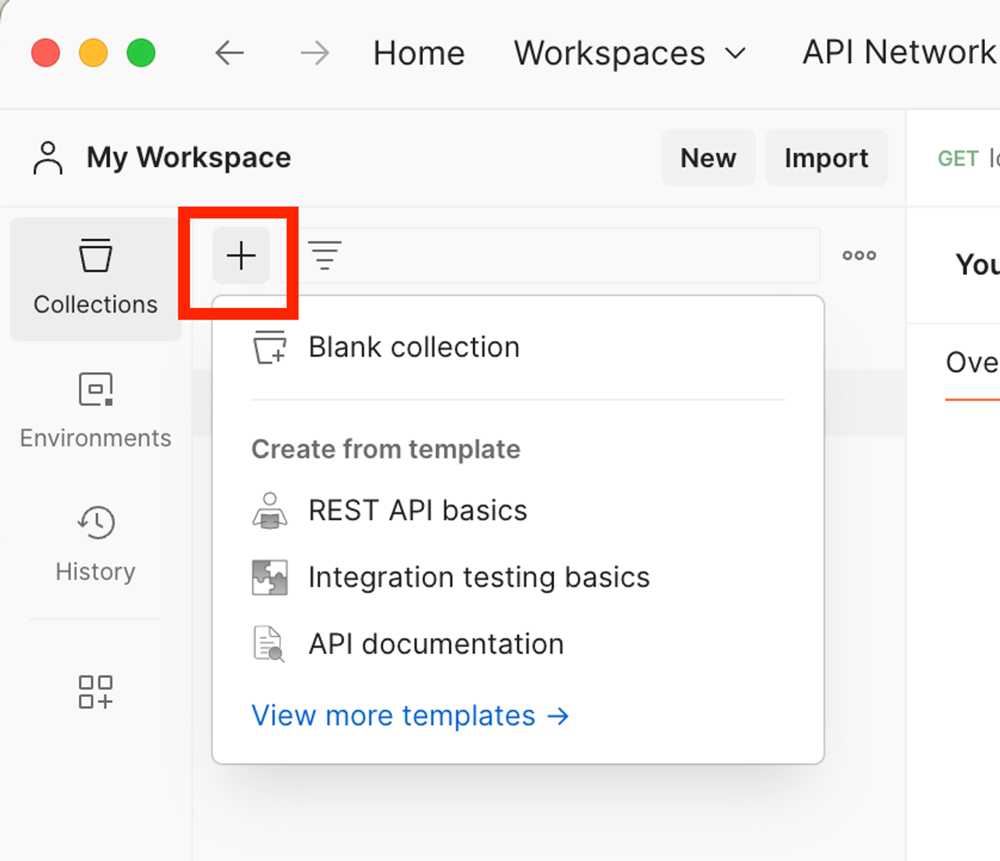
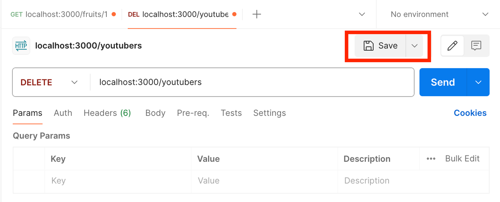
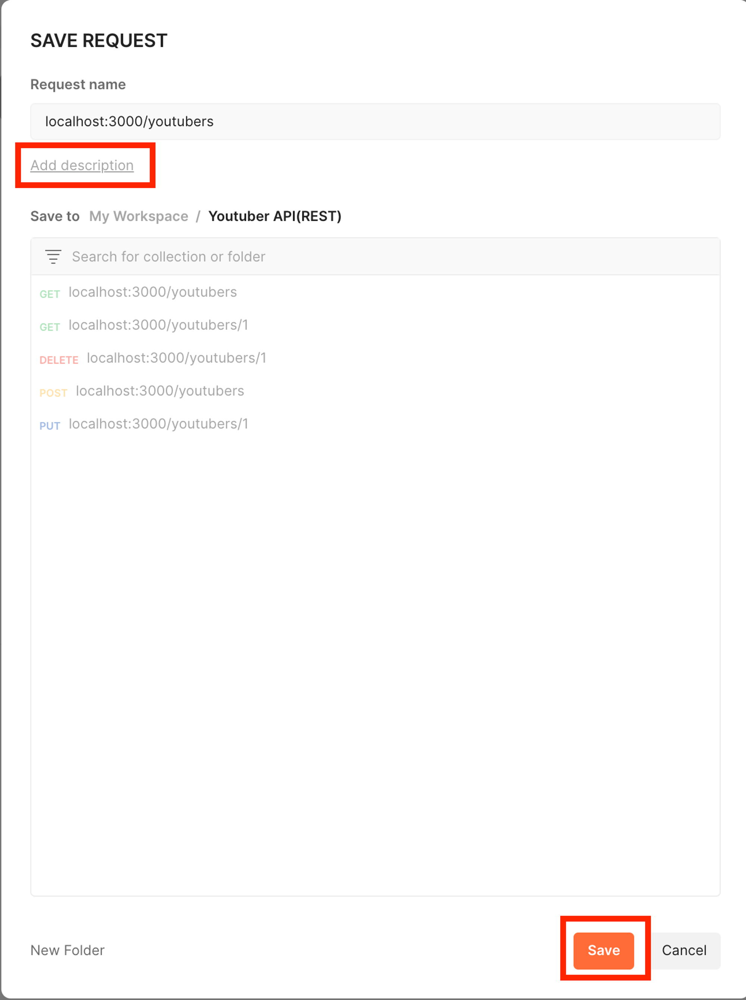

# <Node.js 및 Express.js를 사용한 서버 개발 실습 (3)>

# Part 6. Express와 진하게 친해지기

## Chapter 1. 핸들러와 if문 순서

### 1. 핸들러란?

- 요청에 의해 호출되는 메소드를 뜻함
    - ex) “Node”에서의 핸들러 :  “콜백함수” ( `app.HTTP method(path, 핸들러)` )
           ⇒ 지금까지 우리가 사용했던 `function(req, res)`가 이에 해당한다.

### 2. if문 순서

- 사실 대부분의 경우에 if-else문 작성 시, 처음에는 true인 경우를 먼저 작성하는게 코드 가독성을 높여준다.

---

## (틈새강의) Postman의 콜렉션 사용법

- Postman에는 사용했던 각 HTTP method와 URL을 그룹지어 저장할 수 있는 기능이 있다.
- “ 콜렉션 “ 이라는 그룹으로 묶어 저장한다.
    1. [ “ + “ 버튼 ] → [ Blank collection 클릭 ]→ [ 새 콜렉션 이름 지정 ]
        
        
        
    2. 저장할 각 탭의 우측상단에 있는 Save 버튼 클릭
        
        
        
    3. URL + URL method의 설명을 작성하고 원하는 콜렉션에 저장
        
        
        

---

## Chapter 2. 제대로 예외 처리를 해보자!

### 1. 객체 배열을 통한 서버 통신과 예외처리

- 객체 배열 fruits를 활용한 코드
    
    ```jsx
    const express = require('express');
    const app = express();
    
    // 서버 셋팅 : 포트 번호 3000으로 셋팅
    app.listen(3000);
    
    const fruits = [
    	{id : 1, namd : 'apple'},
    	{id : 2, namd : 'orange'},
    	{id : 3, namd : 'strawberry'},
    	{id : 4, namd : 'blueberry'}
    ]
    
    // 과일 전체 조회
    app.get('/fruits', (req,res)=>{
    	if(fruits){
    		res.json(fruits) // JSON array
    		// JSON array의 경우 JSON들의 배열이기에 바로 출력이 가능하다
    	}else{
    		res.json({
    			message : "과일이 없습니다."
    		})
    	}
    })
    
    // 과일 개별 조회
    app.get('/fruits/:id', (req,res)=>{
    	let id = parseInt(req.params.id)
    	let findFruit = fruits.find(f => (f.id == id)) 
    	// find()는 JS의 배열에서 사용할 수 있는 함수
    	// fruits 배열 안에 있는 객체 중, id값이 params.id랑 같은 객체를 반환하겠다.
    
    	if(findFruit){
    		res.json(findFruit)
    	}else{ 
    		// 예외를 터뜨린다. 
    		// 예외가 없다면 프론트엔드에서는 정보를 받지 못하고 백엔드는 그저 아무것도 안하는 것이다.
    		// 서버는 작동되고 있기에 "성공"코드가 전달된다.
    		res.status(404).send( // HTTP 상태코드를 "실패"로 전달해준다.
    			`전달해주신 id값 ${id}에는 저장된 과일이 없습니다.`
    		)
    	}
    })
    ```
    
    - 객체의 배열은 JSON처럼 사용이 가능하다.
    - `배열명.find()`  : 특정 조건을 만족하는 property나 value를 찾을 수 있다.
    - `res.status(상태코드)` : HTTP 상태 코드를 정하여 보낼 수 있다.
        
        **💥 클라이언트(사용자, 화면)와 소통을 정확하게 하기 위해 사용하는 것이다 💥**
        

### 2. 이전에 만들었던 youtuber-demo.js도 예외처리 및 상태코드를 추가해보자(POST 제외)

- youtuber-demo.js 코드 예외처리 추가 부분
    
    ```jsx
    // ...
    // 등록되어있는 전체 유튜버 조회 REST API 설계
    app.get('/youtubers', (req,res)=>{
        if(db.size !== 0){ // Map객체의 경우 안에 값이 없을 때, Null값이 되지 undefined가 되지 않는다.
            let youtubers = {} // 각 유튜버의 정보들을 담을 객체 선언
            db.forEach((value, key)=>{ // Map객체에 들어있는 값들을 하나씩 확인
                youtubers[key] = value
            })
            res.json(youtubers);
        }else{
            res.status(404).json({
                message : "조회할 유튜버가 없습니다."
            })
        }
    })
    // ...
    ```
    
    - Map 객체의 경우, clear함수로 내부 데이터를 모두 삭제해도 undefined가 아닌 Null 값이 된다.
        
        if-else문 사용시 주의하도록 하자.
        
    - 여기서도 예외의 경우에는 상태코드를 같이 보내줍니다.
- youtuber-demo.js 코드 상태코드 추가 부분
    
    ```jsx
    // ...
    // 유튜버 개별 조회 REST API 설계
    app.get('/youtubers/:id',(req,res)=>{
        let {id} = req.params
        id = parseInt(id)
        let youtuber_inf = db.get(id);
    
        if(youtuber_inf == undefined){
            res.status(404).json({
                message : `유튜버 정보를 찾을 수 없어요`
            })
        }else{
            res.json(youtuber_inf)
        }
    })
    
    app.use(express.json()) // '미들웨어' : json 설정
    // 새로운 유튜버 등록 REST API 설계
    app.post('/youtubers',(req,res)=>{
        db.set(id++, req.body)
        const {channelTitle} = db.get(id-1)
    
        res.json({
            "message" : `${channelTitle}님, 유튜버 생활을 응원합니다!`
        })
    })
    
    // 기존 유튜버 삭제 REST API 설계
    app.delete('/youtubers/:id',(req,res)=>{
        let{id} = req.params
        id = parseInt(id)
    
        let youtuber_inf = db.get(id)
        if(youtuber_inf==undefined){
            res.status(404).json({
                "message" : `요청하신 ${id}번은 없는 유튜버입니다.`
            })
        }else{
            let {channelTitle} = youtuber_inf
            db.delete(id)
    
            res.json({
                "message" : `${channelTitle}님, 아쉽지만 다음에 뵙겠습니다.`
            })
        }
        
    })
    
    // 전체 유튜버 삭제 REST API 설계
    app.delete('/youtubers',(req,res)=>{
    
        //현재 둥록된 유튜버 현황 확인 필요
        // db에 값이 1개 이상이면, 전체 삭제
        if(db.size >= 1){ 
            db.clear()
            res.json({
                message : "전체 유튜버가 삭제되었습니다."
            })
        }else{ 
            res.status(404).json({
                message : "삭제할 유튜버가 없습니다."
            })
        }
    
    })
    
    // 개별 유튜버 정보 수정 REST API 설계
    app.put('/youtubers/:id',(req,res)=>{
        let {id} = req.params
        id = parseInt(id)
        let msg = ""
        let youtuber_inf = db.get(id)
    
    	// 예외처리
        if(youtuber_inf == undefined){
            res.status(404).json({
                message : `요청하신 ${id}번은 없는 유튜버입니다.`
            })
        }else{
            const oldTitle = youtuber_inf.channelTitle
            
            // HTTP BODY를 통해 수정할 값 받아오기
            const newTitle = req.body.channelTitle
    
            youtuber_inf.channelTitle = newTitle
            db.set(id,youtuber_inf)
    
            res.status(404).json({
                message : `${oldTitle}님 채널명이 ${newTitle}로 수정되었습니다.`
            }) 
        }
    })
    ```
    
    - 기존에 모든 예외처리 부분에 상태코드(404) 추가
    - res.json함수를 줄이기위해 각 경우의 message값을 변수에 저장하여 마지막에 res.json()을 하나만 사용하도록 코드를 작성했었다.
        
        **→ 하지만 경우에 따라 상태코드를 전송하기 위해선 각 경우마다 res.json()을 사용해야되기에 수정하였다.**
        
    - app.post의 경우 예외처리가 까다롭기에 따로 다음에 따로 다루도록 한다.

### 3. youtuber-demo.js 코드의 POST method 부분 예외처리 및 상태코드 추가

- POST method 부분을 예외처리 및 상태코드 추가 하자
    
    ```jsx
    // ...
    // '미들웨어' : json 설정 => req.body를 읽을 수 있게 해주는 모듈
    app.use(express.json()) 
    // 새로운 유튜버 등록 REST API 설계
    app.post('/youtubers',(req,res)=>{
        const channelTitle = req.body.channelTitle    
    
        if(channelTitle){
            db.set(id++, req.body)
            res.status(201).json({
                "message" : `${db.get(id-1).channelTitle}님, 유튜버 생활을 응원합니다!`
            })
        }else{
            res.status(400).json({
                message : "요청 값을 제대로 보내주세요"
            })
        }
    
    })
    // ...
    ```
    
    - **POST method의 경우 사용자로부터 받는 값(req.body)이 정상인지 고려해야 한다.**
    - **POST method를 통한 “등록”을 성공한 경우의 상태코드는 201번을 사용한다.**
    - **req.body값이 정상이 아닌 경우의 상태코드는 400번을 사용한다.**

# Part 7. 미니 프로젝트

## Chapter 1. 프로젝트 시작 (설계단계)

### 1. Youtube 사이트를 운영해 볼까요?

- 회원 API 설계
    
    ▶️ **회원 기능**
    
    ✔️ 로그인 : POST /login
    
    - req : BODY (id, pwd)
    - res 201 : `${name}님 환영합니다` // 로그인 후 '메인페이지'로 이동
    
    ✔️ 회원 가입 : POST /join
    
    - req : BODY (id, pwd, name)
    - res 201 : `${name}님 환영합니다` // 회원가입 후 '로그인 페이지'로 이동
    
    ✔️ 회원 개별 “조회” : GET /users/:accountNum
    
    - req : URL (accountNum)
    - res 200 : id, name
    
    ✔️ 회원 개별 “탈퇴” : DELETE /users/:accountNum
    
    - req : URL (accountNum)
    - res 200 : `${name}님 다음에 또 뵙겠습니다.` // 회원 탈퇴 후 '메인페이지'로 이동

---

- 채널 API 설계
    
    ▶️ **회원 별 채널 기능**
    
    ( 전제 조건 :  계정 1개당 채널 100개를 가질 수 있다 )
    
    ✔️ 채널 생성 : POST /channels
    
    - req : BODY (channelTitle)
    - res 201 : `${channelTitle}님 채널을 응원합니다` 
              👉 추후에는 실제 다른 페이지를 띄워보자! ex) 채널 관리 페이지
    
    ✔️ 채널 수정 : PUT /channels/:id
    
    - req : URL (id), BODY (channelTitle)
    - res 200 : `채널명이 성공적으로 수정되었습니다. 기존 ${channelTitle} -> 수정${channelTitle}`
    
    ✔️ 채널 삭제 DELETE /channels/:id
    
    - req : URL (id)
    - res 200 : `삭제 되었습니다.`
             👉 추후에는 유튜브 메인페이지를 띄워보자
    
    ✔️ 채널 전체 “조회” GET /channels
    
    - req : X
    - res 200 : 채널 전체 데이터
    
    ✔️ 채널 개별 “조회” GET /channels/:id
    
    - req : URL (id)
    - res 200 : 채널 개별 데이터

---

## Chapter 2. “회원 API 설계”를 바탕으로 기능 구현 (구현단계)

### 1. 회원가입, 회원 개별 조회, 회원 개별 탈퇴 기능 구현

```jsx
// express 모듈 셋팅
const express = require('express')
const { isNull } = require('util')
const app = express()
app.listen(7777)
app.use(express.json()) // => req.body를 JSON 형식으로 읽을 수 있게 해주는 모듈

let db = new Map()
let accountNum = 1

// 로그인
app.post('/login', (req,res)=>{
    const {id, pwd} = req.body

    if(id && pwd){
        res.status(201).json({
            "id" : `입력받은 id값 : ${id}`,
            "pwd" : `입력받은 pwd값 : ${pwd}`
        })
    }else{
        res.status(400).json({
            Message : "아이디 또는 비밀번호를 정확히 입력해주세요"
        })
    }
})

// 회원가입
app.post('/join', (req,res)=>{
    const {id, pwd, name} = req.body
    if(id && pwd && name){
        console.log(req.body)
        db.set(accountNum++, req.body)
        res.status(201).json({
            message : `${db.get(accountNum-1).name}님 환영합니다.`
        }) 
    }else{
        res.status(400).json({
            Message : `입력 값을 다시 확인해주세요`
        })
    }
})

// route()를 활용한 REST API 구조 변경
app.route('/users/:accountNum')
    .get((req,res)=>{
        let {accountNum} = req.params  
        accountNum = parseInt(accountNum)
        const user = db.get(accountNum)
    
        if(user == undefined){
            res.status(404).json({
                message : `계정번호 ${accountNum}번으로 등록된 유저는 존재하지 않습니다.`
            })
        }else{
            res.status(200).json({
                id : user.id,
                name : user.name
            })
        }
    })
    .delete((req,res)=>{
        let {accountNum} = req.params  
        accountNum = parseInt(accountNum)
        const user = db.get(accountNum)
    
        if(user == undefined){
            res.status(404).json({
                message : `계정번호 ${accountNum}번으로 등록된 유저는 존재하지 않습니다.`
            })
        }else{
            db.delete(accountNum)
            res.status(200).json({
                message : `${user.name}님 다음에 또 뵙겠습니다.`
            })
        }
    })

// ⬆️⬆️⬆️  route를 활용하여 REST API의 구조를 변경한 방법  ⬆️⬆️⬆️
// ⬇️⬇️⬇️       기존에 사용했던 REST API 설계방법        ⬇️⬇️⬇️

// // 회원 개별 조회
// app.get('/users/:accountNum', (req,res)=>{
//     let {accountNum} = req.params  
//     accountNum = parseInt(accountNum)
//     const user = db.get(accountNum)

//     if(user == undefined){
//         res.status(404).json({
//             message : `계정번호 ${accountNum}번으로 등록된 유저는 존재하지 않습니다.`
//         })
//     }else{
//         res.status(200).json({
//             id : user.id,
//             name : user.name
//         })
//     }
// })

// // 회원 개별 탈퇴
// app.delete('/users/:accountNum', (req,res)=>{
//     let {accountNum} = req.params  
//     accountNum = parseInt(accountNum)
//     const user = db.get(accountNum)

//     if(user == undefined){
//         res.status(404).json({
//             message : `계정번호 ${accountNum}번으로 등록된 유저는 존재하지 않습니다.`
//         })
//     }else{
//         db.delete(accountNum)
//         res.status(200).json({
//             message : `${user.name}님 다음에 또 뵙겠습니다.`
//         })
//     }
// })
```

- route()를 사용하여 REST API 설계 구조를 변경해 볼 수 있었다.