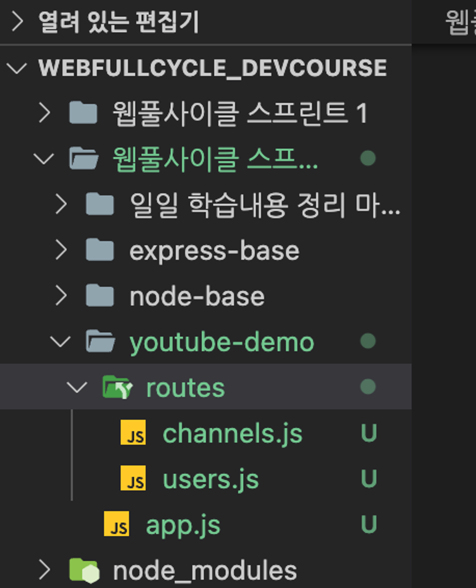

# <REST API 개발 실습 (2)>

# Part 8. 미니프로젝트 고도화

## Chapter 1. router

### 1. Node.js에서의 라우팅이란?

- Request(요청)이 날아왔을 때, 원하는 경로에 따라 적절한 방향으로 경로를 안내해주는 것
- Express.js의 경우
    - URL + HTTP Method로 사용자가 요청을 날리면
    - **우리는 각 경우에 맞는 콜백함수를 정해주었다 == 라우팅**

### 2. user-demo.js와 channel-demo.js 합쳐보기

1. **routers 폴더 생성 및 파일 이동**
    
    
    
2. **app.js 생성**
    
    ```jsx
    // app.js
    
    // express 모듈 셋팅
    const express = require('express')
    const app = express()
    app.listen(7777)
    ```
    
    - user-demo.js와 channel-demo.js를 한번에 사용하기 위해 지금까지 사용했던
        - const app = express()
        - app.listen(7777)
        
        위의 2가지 코드를 app.js에서 사용하도록 변경
        
3. **user-demo.js 모듈화**
    - app → router 변경
        
        ```jsx
        // express 모듈 셋팅
        const express = require('express')
        const router = express.Router(); 
        // app.js에서 router로 접근할 수 있도록 변형
        // 변경 전 : const app = express()
        // 변경 후 : const router = express.Router(); 
        
        router.use(express.json()) 
        // expres.json() : req.body를 JSON 형식으로 읽을 수 있게 해주는 모듈
        // ...
        module.exports = router // 외부 js파일에서 사용할 수 있도록 export 진행
        ```
        
4. **channel-demo.js 모듈화**
    - app → router 변경
        
        ```jsx
        // express 모듈 셋팅
        const express = require('express')
        const router = express.Router();
        
        router.use(express.json())
        // expres.json() : req.body를 JSON 형식으로 읽을 수 있게 해주는 모듈
        // ...
        module.exports = router // 외부 js파일에서 사용할 수 있도록 export 진행
        ```
        
5. **app.js에서 1, 2번 모듈 사용하기**
    - user-demo와 channel-demo 가지고와서 사용하기
        
        ```jsx
        // app.js 파일 코드 추가
        
        // express 모듈 셋팅
        const express = require('express')
        const app = express()
        app.listen(7777)
        
        const userRouter = require('./routes/users') // user-demo 소환
        const channelRouter = require('./routes/channels') // channel-demo 소환
        
        app.use("/", userRouter)
        app.use("/channels", channelRouter)
        ```
        
        - require와 use를 사용하여 모듈화된 각 demo 파일의 라우터를 사용합니다.
        - channel-demo.js파일의 route 경로에서 “ /channels” 경로가 모든 경우에 공통적으로 들어가기에 channelRouter를 use할 때 공통 경로를 빼줄 수 있습니다.
        - 그리고 channel-demo.js에서 각 경로마다 “ /channels “를 제거해주면 됩니다.
            - “ /channes “를 channel-demo.js에서 삭제하지 않으면 요청 주소에 /channels가 중복됩니다.
            - ex) 채널 생성 주소로 접근한다면 : [localhost:7777/channels/channels](http://localhost:7777/channels/channels) 와 같은 주소로 접근하게 됩니다.
        - router로서 사용되는 파일들의 이름은 정석적으로 “복수형”으로 작성되기에 변경하였습니다.
            - user-demo → users
            - channel-demo → channels

## Chapter 2. 회원마다 채널을 가질 수 있도록 ERD 그려보기

### 1. 간단히 [회원&채널 ERD]를 그려보자

**회원**

| id | password | name |
| --- | --- | --- |
| testId1 | 1234 | tester1 |
| testId2 | 5678 | tester2 |
|  |  |  |

**채널**

| channel_Num | channelTitle | id |
| --- | --- | --- |
| 1 | 달려라재현 | testId1 |
| 2 | 뛰어라재현 | testId1 |
| 3 | 걸어라재현 | testId2 |

---

### 2. [회원&채널 ERD]를 바탕으로 API 설계 수정

- 채널 API 설계
    
    ▶️ **회원 별 채널 기능**
    
    ( 전제 조건 :  계정 1개당 채널 100개를 가질 수 있다 )
    
    ✔️ 채널 생성 : POST /channels
    
    - req : BODY (channelTitle, **id**)
    - res 201 : `${channelTitle}님 채널을 응원합니다` 
              👉 추후에는 실제 다른 페이지를 띄워보자! ex) 채널 관리 페이지
    
    ✔️ 채널 수정 : PUT /channels/:id
    
    - req : URL (id), BODY (channelTitle)
    - res 200 : `채널명이 성공적으로 수정되었습니다. 기존 ${channelTitle} -> 수정${channelTitle}`
    
    ✔️ 채널 삭제 DELETE /channels/:id
    
    - req : URL (id)
    - res 200 : `${채널명}이 정상 삭제 되었습니다.`
             👉 추후에는 유튜브 메인페이지를 띄워보자
    
    ✔️ **회원의** 채널 전체 “조회” GET /channels
    
    - req : **BODY (id)**
    - res 200 : 채널 전체 데이터 ( JSON Array 형식 )
    
    ✔️ 채널 개별 “조회” GET /channels/:id
    
    - req : URL (id)
    - res 200 : 채널 개별 데이터
    - **회원&채널 ERD를 통해 회원별로 채널을 생성 및 조회하기위해서 회원의 id가 필요하게 되었다.
    하지만 id같은 개인정보의 경우 URL로 받을 수 없고, HTTP BODY에 넣어서 받아와야 한다.**

### 3. 수정된 채널 API 설계대로 코드 수정

- 채널 생성
    - 채널 생성 기능의 경우, BODY에 사용자의 id값이 필요해졌다.
    - 기존 코드에서 채널 생성의 경우 채널 DB에 BODY값을 그대로 저장하였다.
    - 따라서 코드 상 수정은 없으며, Postman에서 요청 시 BODY값 안에 id값도 추가로 넣어주면 된다.
        
        → 이제 채널 생성 시, 채널 DB에 누가 생성했는지에 대한 변수 id값도 저장되게 되었다.
        
- 회원의 채널 전체 “조회”
    
    ```jsx
    // ...
    router
        .route('/')
        .get((req,res)=>{   // 채널 전체 조회
    
            // 예외 처리 2가지
            // 1) id가 BODY에 없는 경우 -> 로그인을 하라고 알림
            // 2) id가 가진 채널이 없는 경우
    
            let {id} = req.body
            let channels = []
    
            if(db.size && id){ // 1) 예외처리 해결
                db.forEach((value, key)=>{
                    if(id === value.id)
                        channels.push(value)
                })
    
                if(channels.length){ // 2) 예외처리 해결
                    res.status(200).json(channels) 
                }else{
                    notFoundChannel()
                }
            }else{
                notFoundChannel()
            }
    
        }) 
        
    // ...
    
    function notFoundChannel(){
        res.status(404).json({
            message : "채널 정보를 찾을 수 없습니다."
        })
    }
    
    ```
    
    - BODY로 입력받은 id값으로 등록된 채널만 모아서 응답합니다.
    - id값에 따른 예외처리 2가지
        1. id가 BODY에 없는 경우 → 로그인을 하라고 알림
        2. id가 가진 채널이 없는 경우 → 조회할 채널이 없다고 알림
    - if문을 축약해서 코드 리팩토링하기
    - 404코드에 대한 응답이 중복되기에 따로 함수로 만들어 호출하기
        - `notFoundChannel` 함수 참고
    

## Chapter 3. 백엔드 기초 마무리

### 1. 회원 API 설계 수정!

- 이전의 [ Chapter 2.회원마다 채널을 가질 수 있도록 ERD 그려보기 ]에서 회원의 ERD를 그리면서 accountNum 데이터를 삭제하였다.
    
    따라서 회원 API 설계도 수정을 해야 한다.
    
- 회원 API 설계
    
    ▶️ **회원 기능**
    
    ✔️ 로그인 : POST /login
    
    - req : BODY (id, pwd)
    - res 201 : `${name}님 환영합니다` // 로그인 후 '메인페이지'로 이동
    
    ✔️ 회원 가입 : POST /join
    
    - req : BODY (id, pwd, name)
    - res 201 : `${name}님 환영합니다` // 회원가입 후 '로그인 페이지'로 이동
    
    ✔️ 회원 개별 “조회” : GET /users~~/:accountNum~~
    
    - req : **BODY (id)**
    - res 200 : id, name
    
    ✔️ 회원 개별 “탈퇴” : DELETE /users~~/:accountNum~~
    
    - req : **BODY (id)**
    - res 200 : `${name}님 다음에 또 뵙겠습니다.` // 회원 탈퇴 후 '메인페이지'로 이동
    - **회원 설계에서 accountNum 데이터가 필요한 부분인 [회원 개별 조회]와 [회원 개별 탈퇴]의 URL이 수정되었다.**
    - **그리고 [회원 개별 조회]와 [회원 개별 탈퇴]에서 id값을 받아오기위해 BODY값에 넣어서 받아야 한다.**

### 2. 수정된 회원 API 설계대로 코드 수정

- 회원 개별 조회 및 개별 탈퇴
    
    ```jsx
    
    // ...
    router
        .route('/users')
        .get((req,res)=>{   // 회원 개별 조회
            let {id} = req.body
            const user = db.get(id)
        
            if(user){
                res.status(200).json({
                    id : user.id,
                    name : user.name
                })
            }else{
                res.status(404).json({
                    message : `아이디 ${id}로 등록된 유저는 존재하지 않습니다.`
                })
            }
        })
        .delete((req,res)=>{    // 회원 개별 탈퇴
            let {id} = req.body
            const user = db.get(id)
        
            if(user){
                db.delete(id)
                res.status(200).json({
                    message : `${user.name}님 다음에 또 뵙겠습니다.`
                })
            }else{
                res.status(404).json({
                    message : `아이디 ${id}로 등록된 유저는 존재하지 않습니다.`
                })
            }
        })
    ```
    
    - URL 수정
        - “ /users/:accountNum “  → “/users”
    - BODY 값을 통해 id 값을 가져와 accoutNum 대신 사용하여 회원DB에서 데이터를 꺼냅니다.
    - 그렇다면 [회원가입] 단계에서 id값으로 회원DB에 저장해야한다.
        
        ```jsx
        // ...
        // 회원가입
        router.post('/join', (req,res)=>{
            const {id, password, name} = req.body
            if(id && password && name){
                const {id} = req.body
                db.set(id, req.body)
                res.status(201).json({
                    message : `${id}님 환영합니다.`
                }) 
            }else{
                res.status(400).json({
                    Message : `입력 값을 다시 확인해주세요`
                })
            }
        })
        // ...
        ```
        
        - 회원가입 코드에서 회원정보를 회원 DB에 저장할때 id값으로 저장하도록 수정
    - 그리고 추가로 [로그인] 부분에서도 응답을 주지 않고 콘솔만 출력하게끔만 해놓았기에 제대로 응답하도록 코드를 보완하였다.
        
        ```jsx
        // ...
        // 로그인
        router.post('/login', (req,res)=>{
            const {id, password} = req.body
            
            checkDB(db,id)
            console.log(loginUser)
           
            if(isExist(loginUser)){ 
                // password도 맞는지 비교
                if(loginUser.password === password){
                    res.status(200).json({
                        message : `${loginUser.name}님 로그인 되었습니다.`
                    })
                }else{
                    res.status(400).json({
                        message : `비밀번호가 틀렸습니다.`
                    })
                }
            }else{
                res.status(404).json({
                    message : `회원정보가 존재하지 않습니다.`
                })
            }
        })
        // ...
        ```
        

### 3. 미니프로젝트 “ 간단한 유튜브 서버 “ 제작 완료!

- 이제 처음에 설계했던 회원 API와 채널 API 설계에 대한 기능들을 백엔드에서 구현하였다.
- 물론 내부 로직이나 추가적인 기능들을 더 추가하면 좋을 것이다.
- Express.js를 활용하여 비교적 쉽게(?) 백엔드의 기본적인 기능들을 구현해볼 수 있어서 정말 좋은 경험이었다.
- 이번 백엔드 기초 시간에 배운 내용들을 항상 복습하며 추가적인 기술과 지식을 더해나가 보도록 노력해보자!