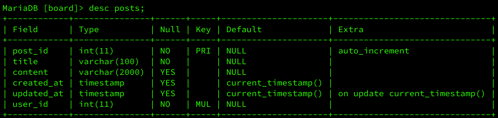
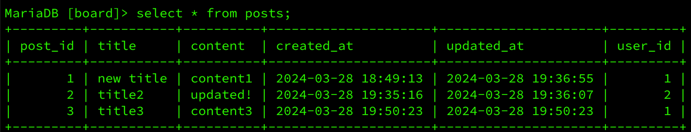
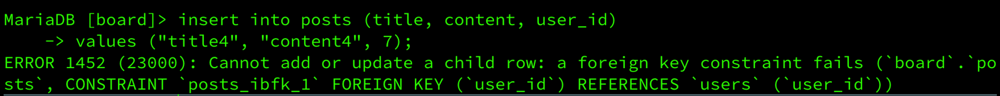
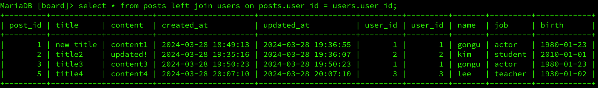
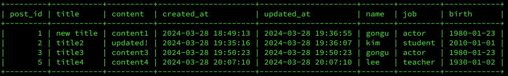

# <Restful API 디자인 및 구현>

# Part 2. 데이터베이스 CLI

## Chapter 1. DB 테이블 생성 실습

### 1. 게시글 DB 생성 실습 CLI 모음

- Board 스키마 생성
    
    ```sql
    create database board;
    use borad;
    ```
    
- 사용자 테이블 생성
    
    ```sql
    create table users (
    	user_id int not null auto_increment,
    	name varchar(30) not null,
    	job varchar(100),
    	birth date,
    	primary key (id)
    );
    ```
    
    - `auto_increment` 속성으로 데이터 삽입 시 마다, user_id 컬럼에 하나씩 INT값이 증가되며 자동으로 저장된다.
    - ‼️ 주의할 점 ‼️
        
        삽입에 실패하더라도 시도한 것으로 인식되어 내부적으로 INT값을 증가시킨다. 
        
        - ex) 3까지 user_id가 등록되어있는 상태에서 데이터 삽입을 한번 실패하고 이후에 정상적으로 데이터를 삽입하면 다음 user_id는 4가아닌 5로 등록된다.
- 사용자 데이터 삽입
    
    ```sql
    insert into users (name, job, birth)
    values 
    	("gongu", "actor", "1980-01-23"),
    	("kim", "student", "2010-01-01"),
    	("lee", "teacher", "1930-01-02");
    ```
    
    - PK인 user_id의 경우 `auto_increment` 속성이 있어서 user_id는 생략하고 데이터를 삽입한다.
    - `date` 타입인 birth의 경우 “YYYY-MM-DD” 형식으로 맞추어 DB에 저장된다.
        - ex) 700101 입력 ⇒ “1970-01-01”로 저장됨.
        - ex) 100101 입력 ⇒ “2010-01-01”로 저장됨.
            - 이렇게 보편적으로 현재 시점에 맞추어 1900년대나 2000년대로 알아서 저장되지만,
            실제로 원하는 값이 저장되지 않을 수 있기에 **가급적이면 처음 넣어줄 때, 온전한 값을 넣어 주는 것이 좋다.**
- 게시글 테이블 생성
    
    ```sql
    create table posts(
    	post_id int not null auto_increment,
    	title varchar(100) not null,
    	content varchar(2000),
    	created_at timestamp default now(),
    	updated_at datetime default now() on update now(),
    	user_id int not null auto_increment,
    	primary key(post_id),
    	foreign key (user_id) references users(user_id)
    );
    ```
    
    - foreign key 생성 후, desc posts; 명령어를 통해 posts 테이블을 살펴보면
        
        
        
        foreign key의 Key값이 “MUL”인 것을 확인할 수 있다.
        
        **“MUL”은 Multiple의 약자로 해당 컬럼에 중복되는 숫자가 들어올 수 있다는 뜻으로**
        
        
        
        이처럼 참조키의 값으로 1이 중복되는 것과 같은 경우를 말한다.
        
    - 자동적으로 foreign key는 mul로 설정된다.
- 게시글 데이터 삽입
    
    ```sql
    insert into posts (title, content, user_id)
    values 
    	("title1", "content1", 1),
    	("title2", "content2", 2),
    	("title3","content3", 1);
    
    ```
    
    - `TIMESTAMP` 타입인 created_at 컬럼의 경우 `current_timestamp()` 속성을 가지게 되며, 데이터 삽입 시 해당 컬럼을 생략하여도 자동으로 현재 시간값이 DB에 저장된다.
    - updated_at 컬럼의 경우, `on update now()` 설정으로 인해 속성으로
    `on update current_timestamp()` 를 가지게 된다. 
    이 속성으로 인해 row가 update될때마다 그 순간의 [날짜+시간] 형식으로 값이 바뀐다.
    - updated_at은 최초 데이터 삽입 시에도 수정으로 인식되기에 최초 삽입 [날짜+시간] 값이 저장된다.
    
    ---
    
    - **만약 foreign key에 user 테이블에 없는 user_id값을 넣어주면 어떻게 될까?**
        
        
        
        - 현재 user는 4명밖에 없기에 user_id는 1~4만 존재한다.
        - user 테이블에 존재하지 않는 user_id값을 참조한다고 하였으니 에러가 발생함을 알 수 있다.

### 2. 추가적인 DBMS 정보

- 테이블의 정보를 확인하는 명령어
    - `DESC [테이블명];`

---

- MySQL (MariaDB)의 날짜/시간 타입
    1. DATE
        - 저장될 데이터의 형식을 [날짜] 형식으로 설정
        - YYYY-MM-DD
    2. TIME
        - 저장될 데이터의 형식을 [시간] 형식으로 설정
        - HH:MM:SS
    3. DATETIME
        - 저장될 데이터의 형식을 [날짜+시간] 형식으로 설정
        - YYYY-MM-DD HH:MM:SS
    4. TIMESTAMP
        - 저장될 데이터의 형식을 [날짜+시간] 형식으로 설정
        - DEFAULT값은 `current_timestamp()` 값으로 설정해야 함.
        - **데이터가 삽입된 순간의 [날짜+시간] 정보를 자동으로 저장해준다.**

### 3. JOIN

- RDBMS의 정규화 과정에서 단점이 존재했었다.
- 바로 다른 테이블의 정보를 찾기 위해선 Foreign key를 타고 들어가서 찾아야 했다는 점이다.
- 이때 JOIN을 사용한다면 조회(SELECT)시에 FK로 관련된 정보를 같이 보여줄 수 있다.
- **물론, 같이 보여준다는 것이 실제로 테이블을 다시 합친다는 것은 아니다. 다시 합치게된다면 해결하려했던 중복문제를 다시 발생시키는 것이기 때문이다.**


### 💡 **즉, 겉으로 보여줄때만 FK로 관련된 정보를 같이 출력해준다는 것이 JOIN 이다.**


- JOIN 예시 코드 1
    
    ```sql
    select * from posts
    left join users on posts.user_id = users.user_id;
    ```
    
    
    
- JOIN 예시 코드 2 (PK, FK 제외하고 출력)
    
    ```sql
    select post_id, title, content, created_at, updated_at, users.name, 
    				users.job, users.birth from posts 
    left join users on posts.user_id = users.user_id;
    ```
    
    